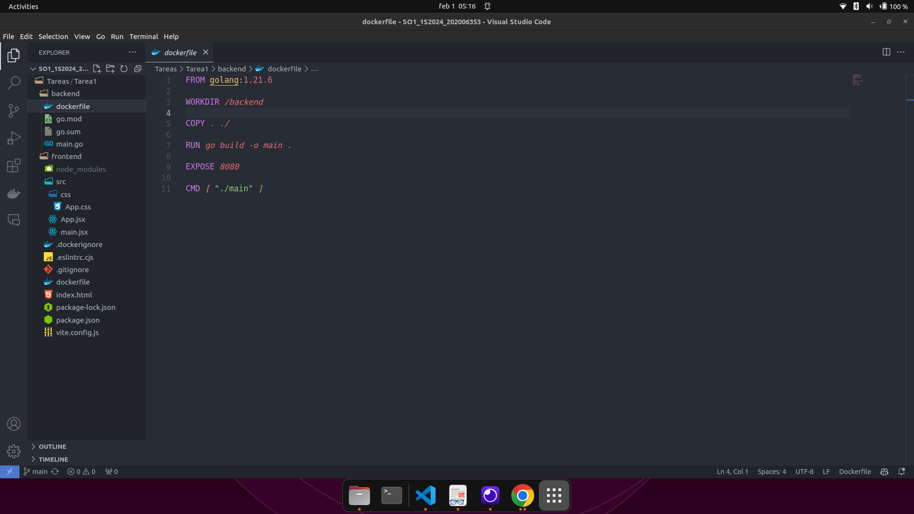
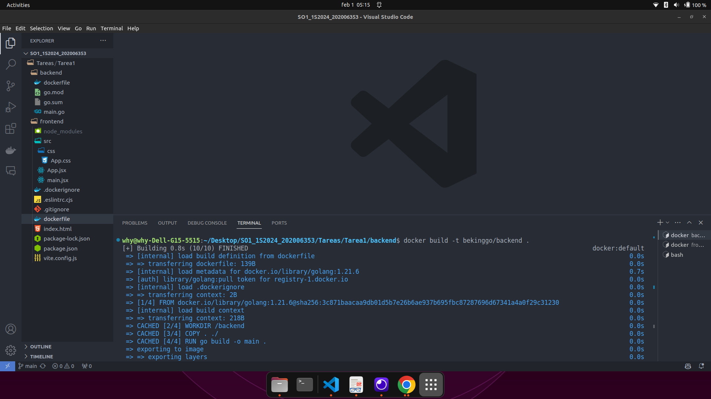
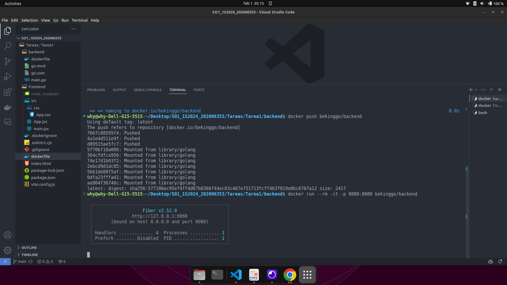
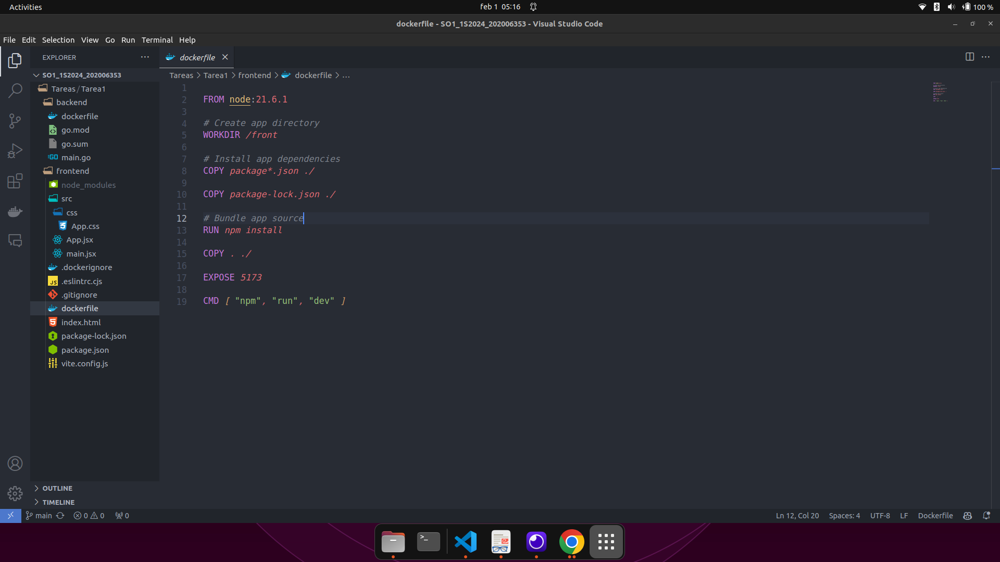
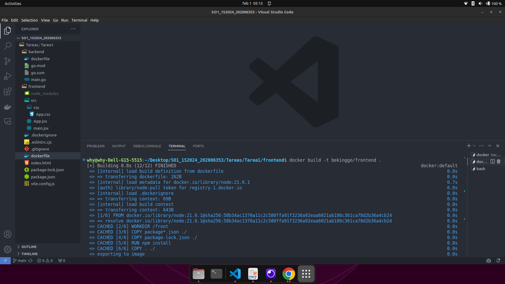
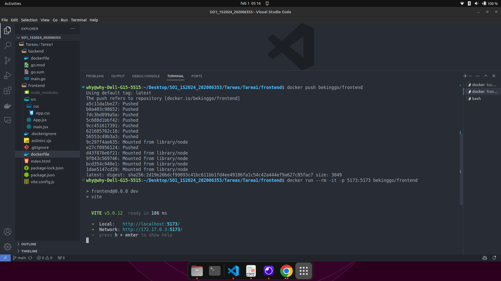
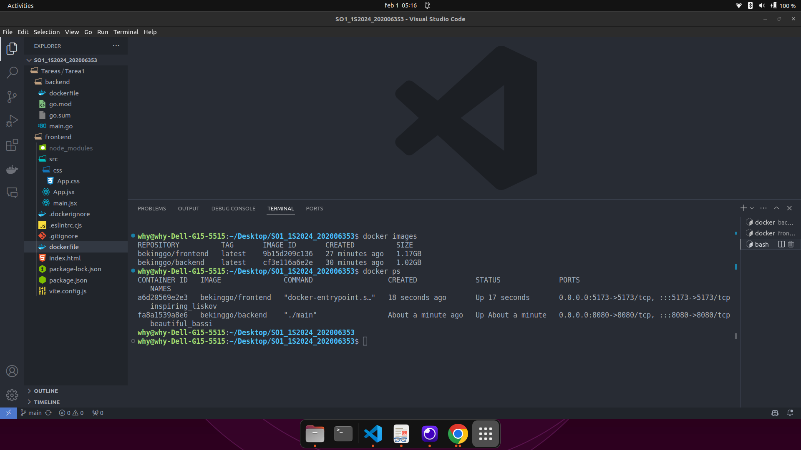

### Documentacion Tarea #1

- Docker file backend:

Se construyo el Dockerfile para almacenar el contenido del backend en un contenedor de docker.

Se realizo el build del contenedor del backend con el comando:

docker build -t bekinggo/backend .

Se realizo el push del contendor hacia Docker Hub con el siguiente comando:

docker push bekinggo/backend

Se realizo el run del contenedor con el siguiente comando:

docker run --rm -it -p 8080:8080 bekinggo/backend

- Docker file frontend:

Se construyo el Dockerfile para almacenar el contenido del frontend en un contenedor de docker.

Se realizo el build del contenedor del frontend con el comando:

docker build -t bekinggo/frontend .

Se realizo el push del contendor hacia Docker Hub con el siguiente comando:

docker push bekinggo/frontend

Se realizo el run del contenedor con el siguiente comando:

docker run --rm -it -p 8080:8080 bekinggo/frontend

- Comprobacion de ejecucion

Se procede a comprobar la creacion de los contenedores con el comando:

Docker images

Se procede a comprobar la ejecucion de los contenedores con el comando:

Docker ps

- Enlace a Video

https://youtu.be/PisncaNxFLM

